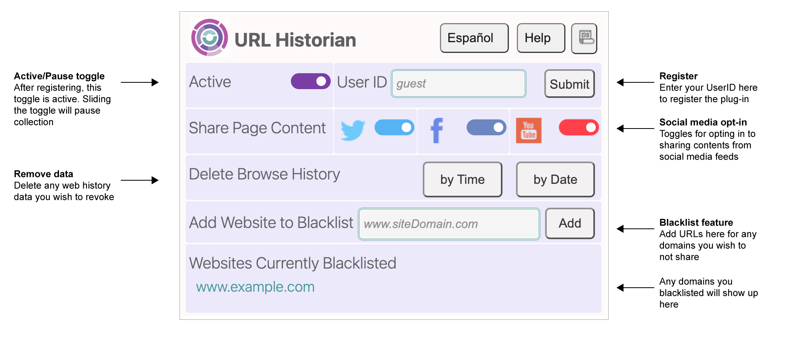

# URL Historian
[Overview](#overview) 
[Introduction](#intro) 
[How to install](#install) 
[How to configure](#configure)  

## Introduction {#intro}

#### URL Historian is a Chrome extension developed by New York University’s <a href="https://csmapnyu.org/">Center for Social Media and Politics (CSMaP)</a> This extension allows participants to share data that contributes to better understanding of how our ever-shifting online environment impacts politics and democracy.

## Overview {#overview}
When the URL Historian plug-in is activated and registered, it automatically begins collecting URLs visited. Data collected through URL Historian is anonymized and used for academic purposes only. All collected data is securely stored on Amazon Web Services (AWS) and only accessible by CSMaP researchers. 
1. You can set the default language of the extension to Spanish using the **"Español"** option.
2. Click the **"Help"** button to go to Frequently Asked Questions (FAQ) on your browser.
3. Use the **User ID** field to enter your unique User ID after completing a survey
4. You can pause data collection using the toggle labeled **"Active"**. When you register the extension, this toggle's default setting is "Active."
5. The **Share Page Content** toggles allow you to share data from social media feeds. This step is optional, see our <a href="https://www.csmapsurveys.org/csmap_privacy_policy.html">privacy policy</a> for more information on what social media data is collected.
6. **Delete Browse History** allows you to revoke data you shared by time or date.
7. The field **Add Website to Blacklist** allows you to list domains you do not want collected. 
8. The area labeled **Websites Currently Blacklisted** will display any domains you have blocked from collection.

For more information about URL Historian's data collection and privacy protection measures, see our <a href="https://www.csmapsurveys.org/csmap_privacy_policy.html">privacy policy</a>. If you have any questions on using the extension, would like to revoke your data, or encounter other technical problems, please reach out to <a href="mailto:csmap@nyu.edu">csmap-surveys@nyu.edu</a>.

	
## How to install {#install}

**Step 1: Download the the URL Historian extension from the Chrome Store**

1. Go to the URL Historian page from your Chrome browser using a laptop or desktop computer: https://chrome.google.com/webstore/detail/url-historian/imdfbahhoamgbblienjdoeafphlngdim/related?hl=en
2. From the URL Historian page, click on the blue “Add to Chrome” button to start installing the extension.
3. A pop-up window will appear to inform you of the data the extension can read, click “Add Extension” to accept.
4. The extension will install automatically. It will need to be registered before setup is complete. 

**Step 2: Submit your User ID to register the extension**

5. Access the extension by clicking on the extensions (puzzle piece) icon to the right of the address bar on the Chrome browser. 
6. Select URL Historian from the dropdown menu.
7. When the extension window appears, enter your user id provided through the survey in the field at the top right. 
8. When you hit “Submit,” a pop-up window will appear prompting you to enter your Survey ID provided by the survey.

	
## How to configure {#configure}

	
### Web browsing history

When the plug-in is registered and activated, it automatically begins collecting URLs visited. You can pause and resume data collection at any time through options on the extension interface. You can also block specific domains from being collected by adding the URLs of these domains to a blacklist feature within the extension.

### Social Media Data

You can also opt-in to sharing data from popular social media websites. To contribute this data, you can toggle the following options: 
	
* the Twitter option will collect tweet data when you visit twitter.com,
* the YouTube option will collect videos listed when visiting youtube.com,
* the Facebook option will solely collect URLs that appear on your Facebook pages when visiting facebook.com.

This data is only collected if a you opt-in to add these sites. Each social media site is activated separately. Data will only be collected from the social media websites that you have opted-in to sharing.

### How to control what you share
**Pausing data collection**

You can pause data collection using the pause toggle feature on the extension. This will pause all data collection until you toggle the pause control back to active.

**Removing data**

You can revoke your shared data at any time. Within URL Historian, you can delete data that has been shared for up to ten days after it was collected. If more than ten days have passed since data was collected, you can contact NYU CSMaP Engineers at csmap-engineers@nyu.edu to request your data be deleted.

**Participation**

Participation in this study is voluntary. You may refuse to participate or withdraw at any time without penalty. To revoke your consent of any portion of a study, email <a href="mailto:csmap-surveys@nyu.edu">csmap-surveys@nyu.edu</a>, where your request will be handled by the appropriate teams. 

If there is anything about the study or your participation that is unclear or that you do not understand, or if you have questions or wish to report a research-related problem, you may contact <a href="mailto:csmap-surveys@nyu.edu">csmap-surveys@nyu.edu</a>.
	
	
	
